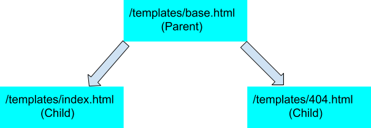

# Flask Templates
### part1
[](https://drive.google.com/file/d/12BpcKRfZyyCpb0xGbqFcTR7qWyXtFgsp/view?usp=sharing "Jinja2")
### part2
[](https://drive.google.com/file/d/1OI4Mob4ranl_3Uci8gCKSlacFo382ODr/view?usp=sharing "jinja2")


# Flask საწყისები

[ოფიციალური გვერდი](https://palletsprojects.com/p/flask/) | [დოკუმენტაცია](https://flask.palletsprojects.com/en/1.1.x/) | [GitHub](https://github.com/pallets/flask)


ფლასკი Python-ში დაწერილი ვებ მიკრო ფრეიმვორკია. Flask-ის გამოყენებით მარტივად და სწრაფად შეგიძლიათ ააწყოთ მარტივი ვებ სერვისები პითონში. და პროექტის გართულებასთან ერთად დახუნძლოთ აპლიკაცია უამრავი შესაძლებლობით, რომელსაც [flask-ის ნაკრებები და third-party
ბიბლიოთეკები გვთავაზობენ](https://www.fullstackpython.com/flask-extensions-plug-ins-related-libraries.html).

## დაყენება

### დაყენება pip მენეჯერით

```python
pip install flask
```

### დაყენება conda მენეჯერით

```python
conda install flask
```

ინსტალაციის წარმატებით დასრულების შესამოწმებლად, ინტერპრეტატორის გამოყენებით სცადეთ ბიბლიოთეკის შემოტანა:

```python
from flask import Flask
```

_თუ ინტერპრეტატორი გეტყვით რომ flask მოდული ვერ მოიძებნა, ეს ნიშნავს რომ ინსტალაციის საფეხური წარმატებით არ შესრულებულა._

## [საწყისი აპლიკაციის შაბლონი](https://flask.palletsprojects.com/en/1.1.x/quickstart/#a-minimal-application)

```python
from flask import Flask

app = Flask(__name__)

@app.route('/')
def home():
    return "<h1>გამარჯობა</h1>"

if(__name__ == "__main__"):
    app.run()
```

| კოდი                                       | მნიშვნელობა                                                                                                                                                                                                 |
| ------------------------------------------ | ----------------------------------------------------------------------------------------------------------------------------------------------------------------------------------------------------------- |
| `from flask import Flask`                  | ბიბლიოთეკა flask-იდან შემოიტანე Flask კლასი                                                                                                                                                                 |
| `app = Flask(__name__)`                    | ქმნის აპლიკაციის ობიექტს Flask-ის მეშვეობით. გადაცემული `__name__`-ის მეშვეობით აპლიკაცია საზღვრავს პროგრამის საწყის მდებარეობას, რის მიმართაც ეძებს/ტვირთავს დამატებით რესურსებს.                          |
| `@app.route('/')`                          | აპლიკაციის მისამართის დეკორატორი რომელიც, Fask-ს აწვდის ინფორმაციას თუ რა მისამართზე-ზე უნდა გააქტიურდეს მის ქვეშ მდგომი ფუნქცია.                                                                           |
| `def home(): return "<h1>გამარჯობა</h1>" ` | ფუნქცია რომელიც აქტიურდება დეკორატორით განსაზღვრულ მისამართზე, ასრულებს გაწერილ ფუნქციონალს და აბრუნებს მომხმარებლისთვის საჩვენებელ მონაცემს.                                                               |
| `if(__name__ == "__main__")`               | ამოწმებს პროგრამა ეშვება თუ არა საწყისი მდებარეობიდან.                                                                                                                                                      |
| `app.run()`                                | app ობიექტის run მეთოდის გამოყენებით გაეშვება ჩვენს მიერ აწყობილი Flask აპლიკაცია. (მეთოდის გამოძახებისას შეგიძლიათ გადასცეთ port ცვლადის მნიშნველობა რაც განსაზღვრავს თუ რომელ პორტზე გაეშვება აპლიკაცია). |

## ტერმინალი

ინტერნეტ ბრაუზერით ლოკალურ სერვერთან დაკავშირებისას (ჩემს შემთხვევაში მისამართზე: http://127.0.0.1:5000/), საინფორმაციო ველში გამოვა ჩანაწერი "გამარჯობა", ხოლო ტერმინალში შეამჩნევთ
შესაბამის შეტყობინებებს.

     * Serving Flask app "__main__" (lazy loading)
     * Environment: production
       WARNING: This is a development server. Do not use it in a production deployment.
       Use a production WSGI server instead.
     * Debug mode: off
     * Running on http://127.0.0.1:5000/ (Press CTRL+C to quit)
    127.0.0.1 - - [30/Mar/2020 01:31:33] "GET / HTTP/1.1" 200 -
    127.0.0.1 - - [30/Mar/2020 01:31:37] "GET / HTTP/1.1" 200 -

## HTTP მეთოდები


_[HyperText Transfer Protocol](https://en.wikipedia.org/wiki/Hypertext_Transfer_Protocol)_ -ის მიზანია უზრუნველყოს კომუნიკაცია მომხმარებელსა და სერვერს შორის,
წინასწარ გაწერილი მეთოდების ნაკრებით.

ვებ აპლიკაციის ფუნცქიაა დაამუშავოს ვებ მოთხოვნები. ვებ აპლიკაცია იყენებს სხვადასხვა ტიპის HTTP მოთხოვნებს მომხმარებელთან სასაუბროთ. ყოველი მეთოდის ტიპის მოთხოვნაზე წინასწარ ვწერთ ფუნქციონალს და ვაბამთ
მას შესაბამის მისამართზე.
ვებ საიტზე შესვლისას, სერვერზე გაშვებული პროგრამის ტერმინალის ფანჯარაში გამოჩნდება ინფორმაცია (ლოგი) შემოსული მოთხოვნის შესახებ, მაგ.:

`127.0.0.1 - - [30/Mar/2020 01:31:33] "GET / HTTP/1.1" 200 -`

მოცემული ლოგის სტრუქტურა შემდეგნაირია:

> მისამართი - - [თარიღი(დღე/თვე/წელი საათი:წუთი:წამი)] > "მეთოდის_ტიპი მისამართი პროტოკოლი" სტატუსი -

### HTTP მეთოდების ძირითადი ტიპები:

- **GET** - მონაცემის ამოღება
- **POST** - მონაცემის შექმნა
- **PUT** - მონაცემის განახლება/შექმნა
- **DELETE** - მონაცემის ამოშლა

სერვერის მხარეს ყველა მოთხოვნის ტიპი ერთნაირად მუშავდება თუმცა განსხვავდება თითოეული მეთოდის ფუნქციონალი, იმის მიხედვით თუ რა დავალების შესასრულებლად გაწერს დეველოპერი კონკრეტულ მეთოდს.
განსხვავებული ტიპები მეთოდები ოპერაციების კატეგორიზაციასა და მოწესრიგებაში გვეხმარება.
ეს გვაძლევს შესაძლელბლობას ერთ მისამართზე რამოდენიმე სხვადასხვა ტიპის მოთხოვნის განვათავსოთ.

## Routing

სტანდარტულად, აპლიკაციაში route-ით ახალი მისამართის გაწერისას, ფუნქციონალი რომელსაც დეკორატორის ქვეშ განვათავსებთ GET მეთოდის მოთხოვნაზე მოახდენს რეაგირებას.
სწორედ GET ტიპის მოთხოვნას აგზავნის ბრაუზერი მითითებულ მისამართზე გადასვლისას, შესაბამისად სწორედ ამ მეთოდის ქვეშ უნდა დავაბრუნოთ მომხმარებლისთვის გამოსაჩენი რესურსი. მარშუტის ასაწყობად route მეთოდს პარამეტრად უნდა გადავცეთ სასურველი მისამართი:

```python
@app.route('/')
def index():
    return 'Index Page'

@app.route('/hello')
def hello():
    return 'Hello, World'
```

ამ რიგად route დეკორატორის გამოყენებით ვაბამთ ფუნქციას შესაბამის მისამართს. კონკრეტული მაგალითი შექმნის ორ მარშუტს:

> server_address/
>
> server_address/hello

ლოკალურად კომპიუტერზე გაშვებული აპლიკაციის მისამართი იქნება `localhost:port` ხოლო სერვერისთვი მიიღებს სერვერის მისამართის მნიშვნელობას, მაგალითად `mysite.ge`.

მიუხედავად იმისა რომ მეთოდის დასახელებას პროგრამის მუშაობისთვის მნიშვნელობა არ აქვს, მეთოდებს **უნდა ერქვათ უნიკალური და მისამართის შესაბამისი სახელი**.

### რესურსზე მეთოდის ტიპის დამატება

ერთ მისამართზე წვდომის დაშვება შესაძლებელია [სხვადასხვა ტიპის მეთოდისათვის](#http-მეთოდები). ამისთვის route მეთოდს მეორე არგუმენტად უნდა გადავცეთ ' methods ' არგუმენტი.

> `methods = ['GET', 'POST']`

მისამართის აწყობის შემდგომ საჭიროა თითოეულ მეთოდს გავუწეროთ საკუთარი ფუნქციონალი. საბოლოოდ რესურსის მეთოდს აქვს მსგავსი სტრუქტურა:

```python
@app.route('/do_something_here', methods = ['POST'])
def do_something_function():

    # კოდი რომელიც მეთოდის ფუნქციონალს ასრულებს

    return 201, 'Created'
```

### დინამიური მისამართები

ვებ აპლიკაციებთან მუშაობისას ხშირად შევხვდებით დინამიურ მისამართებს, რაც გულისხმობს მისამართში ცვლადი პარამეტრების შემოტანას.

მისამართში ცვლადის შესაქმნელად უნდა გამოვიყენოთ `<>` დეკორატორი, რომლის შუაში მოთავსდება ცვლადის სახელი. მაგალითად, `'/profiles/python` მისამართზე გადასვლისას, მისამართში გაწერილი ცვლადი username მიიღებს მნიშვნელობას python. მისამართში გაწერილი ცვლადი შეგვიძლია გადავცეთ მეთოდს და გამოვიყენოთ ფუნქციონალში სურვილისამებრ.

```python
@app.route('/profiles/<username>', methods = ['GET'])
def info_classroom(username):

    # კოდი ბაზიდან საკლასო ოთახზე ინფორმაციის ამოსაღებად

    return classroomInfo
```

#### convertor

სურვილისამებრ შეგიძლიათ გამოიყენოთ კონვერტორი, რომელიც დინამიური მისამართიდან ამოღებულ მნიშვნელობას ცვლადში შეინახავს წინასწარ განსაზღვრულ მონაცემის ტიპად.
ამისთვის უნდა გამოიყენოთ convertor-ის ცვლადის გაწერამდე: `<covertor:variable_name>`

```python
@app.route('/profiles/<string:username>')
def show_user_profile(username):
    # მომხმარებლის პროფილის ჩატვირთვა
    return f'User {username}'

@app.route('/post/<int:post_id>')
def show_post(post_id):
    # პოსტის ჩასატვირთად post_id-ის როგორც integer-ის გამოყენება
    return f'Post {post_id}'

@app.route('/path/<path:subpath>')
def show_subpath(subpath):
    # ქვე-მისამართის გამოტანა
    return f'Subpath {subpath}'
```

##### კონვერტორის ტიპები

| ტიპი     | აღწერა                                                                           |
| -------- | -------------------------------------------------------------------------------- |
| `string` | (default) იღებს ნებისმიერ ტექსტს დახრილი ხაზის გარდა                             |
| `int`    | იღებს დადებით მთელ რიცხვებს                                                      |
| `float`  | იღებს დადებით წილადებს                                                           |
| `path`   | გამოიყენება როგორც `string` მაგრამ იღებს დახრილ ხაზს ქვე-მისამართების ამოსაღებად |
| `uuid`   | იღებს UUID სტრინგს                                                               |

## Debug Mode

პროექტზე მუშაობისას შეიძლება გაგვეპაროს შეცდომები რომლის პოვნაც და გადაჭრაც გახდება საჭირო.
Flask-ზე მუშაობისას შეგიძლია გააქტიურო debug რეჟიმი რომელიც ახალ შესაძლებლობებს მოგცემს.
მაგალითად, ყოველი ცვლილებისას არ მოგვიწევს აპლიკაციის გამორთვა და თავიდან გაშვება. ამისათვის `run` მეთოდს უნდა გადავცეთ შესაბამისი არგუმენტი `debug=True`.

# შაბლონების გამოყენება + [Jinja](#jinja)

_[Templates](https://flask.palletsprojects.com/en/1.1.x/tutorial/templates/#templates)_ ანუ შაბლონები არის ვებგვერდზე განსათავსებელი ფაილები, რომელიც შეიცავს სტატიკურ ინფორმაციას ვებგვერდის ვიზუალურ მხარეზე.

## /static

დინამიური ვებ აპლიკაციის შემადგენელ ელემენტებში შედის სტატიკური რესურსებიც. სტატიკურ რესურსებად შეგვიძლია განვიხილოთ
ვებ აპლიკაციის მუშაობაში ჩართული ყველა ის ელემენტი რომელიც მუშაობის პროცესში არ იცვლება, მაგალითად: ვებ გვერდის შემადგენელი სურათები, სტილური ფაილი და ა.შ.

ამისთვის უბრალოდ უნდა შექმნა დირექტორია /static სადაც შეძლებ იმ სტატიკური ფაილების მოთავსებას, რომლის პროექტში გამოყენებასაც გეგმავ.

სტატიკური ფაილების მისამართის დასაგენერირებლად შეგიძლია გამოიყენო [url_for](<#url_for()_დამხმარე_ფუნქციები>) ფუნქცია:

```python
url_for('static', filename='style.css')
```

ეს მაგალითი დააგენერეირებს მისამართს static/style.css ფაილისთვის.

## [შაბლონის რენდერი](https://flask.palletsprojects.com/en/1.1.x/quickstart/#rendering-templates)

იმისათვის, რომ თემფლეითი დავარენდეროთ, საჭიროა გამოვიყენოთ ფლასკის `render_template` მეთოდი. მას პირველ პარამეტრად უნდა გადავცეთ თემფლეითის დასახელება და ის ავტომატურად იპოვის ფაილს, ამისთვის შესაბამისი ფაილი მოთავსებული უნდა იყოს `templates` დირექტორიაში.

### render_template გამოყენების მაგალითი

```python
from flask import render_template

@app.route('/about')
def about():
    return render_template('about.html',)
```

Flask-ი ავტომატურად იპოვის templates დირექტორიაში არსებულ about.html ფაილს და დაგვიბრუნებს გვერდის რენდერს შესაბამის მისამართზე მოთხოვნის გაგზავნისას.

## [Jinja](https://jinja.palletsprojects.com/en/2.11.x/)


Flask-ი შაბლონებში დინამიური ელემენტების ჩასატვირთად იყენებს [Jinja](https://jinja.palletsprojects.com/en/2.11.x/) -ს ბიბლიოთეკას.
ის თანამედროვე, მარტივად გამოსაყენებელი შაბლონთან სამუშაო ენაა, შექმნილი [Django-ს შაბლონების](https://docs.djangoproject.com/en/3.1/topics/templates/#:~:text=A%20Django%20template%20is%20a,is%20rendered%20with%20a%20context.) პრინციპზე.
მისი სისწრაფის და უსაფრთხოების გამო ის აქტიურად გამოიყენება ფლასკზე აწყობილ ვებ სერვისებში.

ჯინჯას დახმარებით შეგვიძლია მანიპულირება მოვახდინოთ შაბლონებზე და გამოვიყენოთ მისთვის გადაცემული მონაცემები.

### ენის ანატომია

როგორც შევთანხმდით შაბლონური ენები შეიცავენ კოდის სტატიკურ ანუ უცვლელ და დინამიურ ანუ ცვლად ელემენტებს. ცვლადი ელემენტი შეიძლება იყოს
როგორც ცვლადი ასევე პროგრამული ლოგიკა რომელის მუშაობითაც შექმნილი მნიშვნელობა ჩნდება შაბლონში შესაბამისი ფლეისჰოლდერის ნაცვლად.
სინტაქსურად jinja იყენებს ორ ძირითად აღნიშვნას ცვლადები/ლოგიკისთვის და მნიშვნელობის გამოსატანად. ეს აღნიშვნები კოდში გამოიყენება როგორც თეგები.

| თეგი                                                                                             | აღწერა                                                           |
| ------------------------------------------------------------------------------------------------ | ---------------------------------------------------------------- |
| [``](https://jinja.palletsprojects.com/en/2.11.x/templates/#list-of-control-structures) | გამოიყენება პირობის ან ლოგიკის გასაწერად                         |
| [`{{ ... }}`](https://jinja.palletsprojects.com/en/2.11.x/templates/#expressions)                | გამოიყენება მნიშვნელობის შაბლონში გამოყოფილ ადგილას გამოსატანად. |
| [`{# ... #}`](https://jinja.palletsprojects.com/en/2.11.x/templates/#comments)                   | გამოიყენება ფაილში კომენტარის დასამატებლად.                      |

### Jinja-ს გამოყენების მაგალითი

[ავაწყოთ ჯინჯას ფაილი](https://jinja.palletsprojects.com/en/2.11.x/templates/) html-ის დახმარებით და დავაკავშიროთ flask აპლიკაციასთან

#### Python-ს მხარეს

აპლიკაციაში ჯინჯას ფაილის რენდერი

```python
from flask import render_template

@app.route('/hello/<name>')
def hello(name):
    return render_template('hello.html', name=name, my_list = ["ელემენტი 1", "ელემენტი 2", "ელემენტი 3"])
```

#### Jinja-ს მხარეს

ჯინჯას დახმარებით აწყობილი hello.html ფაილი

```jinja
<!doctype html>
<title>შაბლონური Jinja-ს ფაილი</title>

  <h1>მოგესალმები {{ name }}!</h1>

  <h1>გამარჯობა მომხმარებელო!</h1>

<ul>
    
        <li>{{n}}</li>
    
</ul>
```

შესაბამისად render_template ფუნქციისათვის გადაცემული პარამეტრები ხდება გამოყენებადი html შაბლონში jinja-ს დახმარებით, როგორც პროგრამული ლოგიკის ასაწყობად ისე მონაცემთა გადასაცემად.

### [Control Structures](https://jinja.palletsprojects.com/en/2.11.x/templates/#list-of-control-structures)

Control Structures ეწოდება კოდის იმ ნაწილს რომელიც პროგრამის შესრულების ლოგიკის დინებას მართავს. Python -დან უკვე ვიცით რამოდენიმე მსგავსი ელემენტი
მაგალითად if/elif/else პირობები, for და while ლუპები. ჯინჯასთან მუშაობისას ძირითადად გამოვიყენებთ ორ ძირითად სტრუქტურას: [if-statements](https://jinja.palletsprojects.com/en/2.11.x/templates/#if) და [for-loops](https://jinja.palletsprojects.com/en/2.11.x/templates/#for).

მიუხედავად იმისა რომ სინტაქსით jinja წააგავს python-ს, გაითვალისწინეთ რომ კოდის ბლოკის საზღვრები ყოველთვის უნდა გაწეროთ, პირობის დასაწყისი და დასასრული.

#### if

მაგალითად:

```jinja

  <h1>ჭეშმარიტი პირობა!</h1>

  <h1>მცდარი პირობა!</h1>

```

#### macros

მაკრო შეგვიძლია წარმოვიდგინოთ როგორც ელემენტი "ფუნცქია" პროგრამირების ენებიდან. მაკროში შეგვიძლია მოვათვსოთ განმეორებადი კოდის ფრაგმენტი
და გამოვიყენოთ გვერდის აწყობისას. მაგალითად ერთი სტრუქტურის ელემენტი, რომელიც რამდენჯერმე გვინდა გამოჩნდეს ჩვენს ვებ-გვერდზე გარკვეული პირობების გათვალისწინებით
შეიძლება გაიწეროს მაკროში და მოხდეს მისი რამდენჯერმე გამოყენება.

_თუ მაკრო აღწერილია სხვა ფაილში, აუცილებელია მისი პროექტში შემოტანა [import](https://jinja.palletsprojects.com/en/2.11.x/templates/#import) -ის გამოყენებით._

#### [filters](https://jinja.palletsprojects.com/en/2.11.x/templates/#filters)

ცვლდებზე მოქმედებების ჩატარება შესაძლებელია ფილტრების გამოყენებით. სინტაქსურად ფილტრი ცვლადისგან გამოყოფილია `|` სიმბოლოს მეშვეობით და მოთავსებულია ჯინჯას ფუნქციურ თეგში.

ფილტრებს შეგვიძლია გადავცეთ არგუმენტები ისევე როგორც ფუნქციებს: პითონში.

> ჯინჯაში დაწერილი ეს კოდი `{{ listx|join(', ') }}` ექვივალენტურია პითონის შემდეგი კოდის `str.join(', ', listx)`

##### მაგალითი:

```jinja

    This text becomes uppercase

```

[ყველა ჯინჯაში ჩაშენებული ფილტრის ფუნქციონალი](https://jinja.palletsprojects.com/en/2.11.x/templates/#list-of-builtin-filters)

## [Template Inheritance](https://jinja.palletsprojects.com/en/2.11.x/templates/#template-inheritance)

Jinja-ს ერთ-ერთი უძლიერესი მხარეა შაბლონის მემკვიდრეობა. შაბლონის მემკვიდრეობა შესაძლებლობას გვაძლევს შევქმნათ საბაზისო შაბლონი, რომელსაც დინამიურად გამოვიყენებთ და სხვადასხვა შემთხვევაში დავამატებთ სასურველ ინფორმაციას.



ვებგვერდების აწყობისას შეამჩნევთ რომ საიტზე განთავსებული გვერდები იზიარებენ მსგავს ელემენტებს. მაგალითად, როგორც წესი, ნავიგაციის პანელი ყველა გვერდისთვის საერთოა.
იმისთვის რომ ერთი და იგივე ელემენტების გაწერა რამდენჯერმე არ დაგვჭირდეს შაბლონის შექმნისას, გამოვიყენებთ ჯინჯას შაბლონის მემკვიდრეობას.

ამისთვის ჯერ შევქმნით საბაზისო ფაილს basic.html რომელიც შეიცავს საიტის მრავალჯერ გამოყენებად ელემენტებს, ხოლო შემდგომ მას გამოვიყენებთ კონკრეტულ გვერდზე ჩასაშენებლად `` და `` სინტაქსის გამოყენებით.

### base.html საბაზისო შაბლონი

საბაზისო შაბლონში ავაწყობთ გვერდის ძირითად განლაგებას და გავწერთ თუ სად უნდა მოთავსდეს უშუალოდ ჩატვირთული გვერდის კონტენიტ:

```jinja
<div class="container">
      <h2>საბაზისო შაბლონის ნაწილი</h2>
      <br>
      
      <br>
      <h2>საბაზისო შაბლონის ნაწილი</h2>
</div>
```

### page.html

```jinja



<title>მოთხოვნილი გვერდის შიგთავსი</title>


```

## url_for() დამხმარე ფუნქცია

ფლასკი აღჭურვილია დამხმარე ფუნქციით `url_for()`, რომელიც დაგვეხმარება არსებულ შაბლონში გარე ელემენტების ინტეგრირებისას, იქნება ეს სხვა შაბლონი თუ სტატიკური ფაილი.
`url_for()` აგენერირებს მისამართს შესაბამისი საბოლოო დანიშნულებისთვის, რომლის გადაცემაც საწყის არგუმენტად შეგვიძლია.

### გვერდის მისამართის გენერირება

მაგალითად, თუ გვაქვს მისამართ /home-ზე განთავსებული ფუნქციონალი რომელიც საწყის გვერდს ტვირთავს ბრაუზერში, ჩვენ შეგვიძლია შევქმნათ ბმული HTML-ში Jinja-ს გამოყენებით, /home მისამართზე:

#### python-ის მხარეს:

```python
@app.route('/home')
def home():
    return render_template('base.html')
```

#### შაბლონის მხარეს:

```jinja
<a class="nav-link" href="{{url_for('home')}}">Home</a>
```

### ფაილების მისამართის გენერირება

`url_for` -ით შესაძლებელია გამშვებ დირექტორიაში არსებული ფაილების მისამართების ამოღებაც მათ html-ში გამოსაყენებლად.
ამისთვის `url_for` -ს უნდა გადავცეთ დირექტორიის დასახელება და ფაილის დასახელება, რომლის გამოყენებაც გვსურს.

```python
url_for('static', filename='picture.png')
```

<!-- ვფიქრობ ერთი ლექციისთვის ბევრი მოუვათ და დროშიც რომ ჩავეტიოთ დავაკომენტარე ეს ნაწილი და ფორმების ლექციაში ჩავსვათ -->

<!-- ## ფორმის გამოყენება შაბლონში

_ამ ქვეთავში ფორმებს მხოლოდ მიმოვიხილავთ. დეტალურად ფორმების ფლასკში გამოყენება ნახეთ შემდეგ თავში_

HTML-ის სექციაში ვნახეთ თუ როგორ შეგვიძლია შევქმნათ [HTML ფორმები](https://github.com/temurchichua/UnilabPythonDevelopment/tree/master/Chapter2_HTML#ფორმები). ვნახოთ თუ როგორ შეგვიძლია ფორმების ფლასკთან დაკავშირება.

ფორმის ასაწყობად ვიყენებთ form თეგს. form თეგის ერთ-ერთი პარამეტრია action რომელიც ატარებს ინფორმაციას იმ გვერდის მისამართზე, რომელზეც შევსებული ფორმის მონაცემები უნდა გაიგზავნოს.

განვიხილოთ რეგისტრაციის მაგალითი, სადაც ფორმის წარმატებით შევსების შემთხვევაში პროგრამა გადაგვიყვანს შესაბამის success გვერზე.

```jinja2
<form action="{{url_for('success')}}">
        <label for="first_name">სახელი: </label>
        <input type="text" name="first_name">
        <label for="last_name">სახელი: </label>
        <input type="text" name="last_name">
        <input type="submit" value="რეგისტრაცია">
</form>
```

ამ სტანდარტულ ინპუტ ფორმას action პარამეტრად გადავცემთ success ფუნქციონალის მისამართს url_for() მეთოდის გამოყენებით. შესაბამისად, ამ მისამართზე GET ტიპის მოთხოვნად გაიგზავნება ფორმაში შევსებული პარამეტრები.

იმისთვის რომ პროგრამულად შევძლოთ მიღებული პარამეტრების ამოკითხვა, უნდა გამოვიყენოთ flask ბიბლიოთეკიდან request მოდულის request.args ფუნქციონალს. შევქმნათ შესაბამისი ფუნქცია ახალ ენდფოინთზე.

```python
@app.route('/success')
def success():
    data = request.args
    first_name = data.get('first_name')
    last_name = data.get('last_name')
    return render_template('profile_page.html', first_name = first_name, last_name = last_name)
```
    -->
